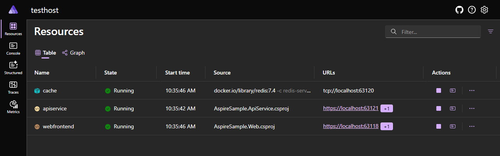
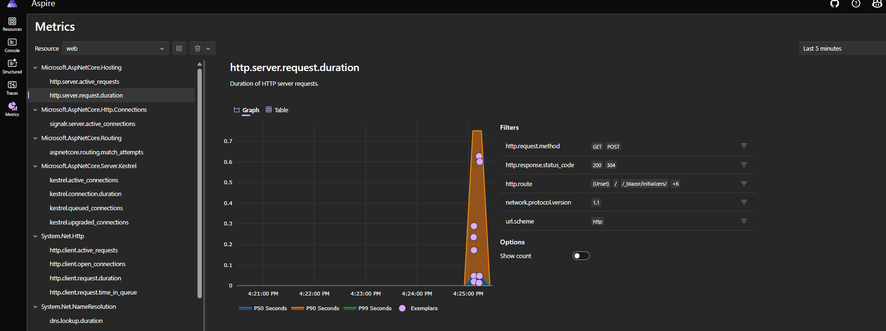

[.NET Aspire](https://learn.microsoft.com/en-us/dotnet/aspire/get-started/aspire-overview) is a new, opinionated application model for building, running, and managing distributed .NET applications. It is designed to make cloud-native development approachable, productive, and reliable—whether you are building microservices, APIs, background workers, or multi-service solutions.

Aspire provides a set of tools, templates, and patterns that help you:
- **Develop**: Quickly scaffold and organize multi-service .NET solutions.
- **Connect**: Easily wire up services, databases, caches, and other dependencies.
- **Observe**: Get built-in health checks, distributed tracing, and metrics out of the box.
- **Configure**: Centralize and manage configuration for all your services.
- **Deploy**: Prepare your app for the cloud, containers, or on-premises environments.

Aspire is ideal for:
- Teams new to distributed/cloud-native .NET development
- Developers who want to focus on business logic, not infrastructure
- Projects that need to scale, integrate, and operate reliably in the cloud

## Key Features
- **Service Discovery & Wiring**: Register and connect services with minimal code.
- **Centralized Configuration**: Manage settings for all services in one place.
- **Observability**: Built-in support for logging, tracing, and metrics.
- **Cloud-Native Ready**: Designed for Azure, AWS, GCP, and on-premises.
- **Developer Dashboard**: Visualize, monitor, and debug your solution locally.

## How Does Aspire Work?

When you create a new Aspire solution, it typically generates two main projects:

- **AppHost**: The orchestrator project responsible for composing, configuring, and running your distributed application locally. It defines all services, resources, and their relationships.
- **ServiceDefaults**: A shared library for centralizing and standardizing configuration, middleware, and service registration across your services.

## AppHost Project

The **AppHost** project is the entry point and orchestrator for your Aspire solution. It defines which services and resources (such as databases, APIs, background workers, and caches) are part of your distributed application, and how they are connected. AppHost is responsible for:

- Registering all projects and resources in your solution
- Defining dependencies and wiring between services (e.g., connecting an API to a database)
- Enabling observability and configuration for the entire application
- Launching the Aspire Dashboard for local development and diagnostics

The AppHost project typically contains an `AppHost.cs` file where you use the Aspire builder API to compose your application. This centralizes orchestration logic and makes it easy to manage and evolve your distributed solution.

For example, in the following AppHosts.cs file, this code creates a local PostgreSQL database container resource and an API service that references it. Aspire automatically manages the connection string and service wiring, making it easy to connect your services to their dependencies:

```csharp
var builder = DistributedApplication.CreateBuilder(args);

// Register a PostgreSQL container
var postgres = builder.AddPostgresContainer("db");

// Register an API project and connect it to the database
builder.AddProject<Projects.ApiService>("apiservice")
    .WithReference(postgres)
    .WaitFor(postgres);

builder.Build().Run();
```

## ServiceDefaults Project

The **ServiceDefaults** project is a shared library commonly used in Aspire-based solutions to centralize and standardize configuration, middleware, and service registration across multiple microservices or API projects. By referencing ServiceDefaults from each service, you can ensure consistent application of best practices such as logging, health checks, OpenTelemetry, and other cross-cutting concerns.

### Typical Uses
- Enabling distributed tracing and metrics collection with OpenTelemetry
- Configuring service discovery and resilient HTTP clients
- Registering health checks and liveness endpoints
- Applying consistent middleware and cross-cutting concerns (e.g., exception handling, CORS, HTTPS redirection)

This approach helps reduce code duplication and enforces uniformity across your distributed application, making it easier to maintain and evolve your solution.

A typical ServiceDefaults project exposes extension methods to apply common configuration to your services. For example:

```csharp
public static class ServiceDefaultsExtensions
{
	public static TBuilder AddServiceDefaults<TBuilder>(this TBuilder builder) 
            where TBuilder : IHostApplicationBuilder
	{
		builder.ConfigureOpenTelemetry();

		builder.AddDefaultHealthChecks();

		builder.Services.AddServiceDiscovery();

		builder.Services.ConfigureHttpClientDefaults(http =>
		{
			http.AddStandardResilienceHandler();
			http.AddServiceDiscovery();
		});

		return builder;
	}
    
    	public static WebApplication MapDefaultEndpoints(this WebApplication app)
	{
		if (app.Environment.IsDevelopment())
		{
			app.MapHealthChecks(HealthEndpointPath);

			app.MapHealthChecks(AlivenessEndpointPath, new HealthCheckOptions
			{
				Predicate = r => r.Tags.Contains("live")
			});
		}

		return app;
	}
}
```

You can then call these extensions in each service's Program.cs:

```csharp
var builder = WebApplication.CreateBuilder(args);
builder.AddServiceDefaults();

var app = builder.Build();
app.MapDefaultEndpoints();
```

This ensures all your services share the same configuration, middleware, and observability setup.

## Aspire Dashboard

The Aspire Dashboard is a web-based UI that provides a real-time, interactive overview of your entire distributed application, including all running services, dependencies, health, and diagnostics. It is automatically launched when you run your Aspire solution locally, making it easy to monitor, debug, and understand your system during development. 

It shows:
- All running services and their health
- Logs, traces, and metrics
- Service dependencies and configuration


*Dashboard overview showing running services and their health.*


*Detailed view of a service's metrics.*

The dashboard provides a real-time, interactive visualization of your distributed application, making it easy to spot issues, monitor dependencies, and understand how services interact. You can drill down into each service to view logs, traces, environment variables, and configuration, helping you quickly diagnose problems and optimize your solution. The Aspire Dashboard is especially valuable during local development and testing, giving you deep insight into the health and behavior of your entire system.


## Learn More
- [Official Documentation](https://learn.microsoft.com/en-us/dotnet/aspire/)
- [GitHub Repository](https://github.com/dotnet/aspire)
- [Getting Started Guide](https://learn.microsoft.com/en-us/dotnet/aspire/get-started/build-your-first-aspire-app?pivots=vscode)
