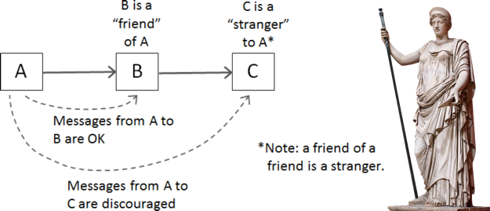

## Clean code

##### What is the clean code ? 

 

Image above is a pretty good explanation on how to distinguish between good and bad code. It is WTF/s, and almost every code will have it, but good code will make your colleagues less mead, software easy to manage and grow, and enable the company to evolve.  

To develop code that will put us on the left side of the above image, developers should always strive to apply a set of principles, patterns and well known best practices.

 

##### Clean code practices :
* simple to read, elegant and efficient.
* It is self-explanatory, logic straightforward, without the need of explanatory comments.
* favors exception throwing instead of error codes, and has complete error handling 
* it should reflect SOLID principles, especially single responsibility.
* does not contain code duplications
* it favors composition over inheritance (does not contain class explosion) and utilizes design patterns.
* it is easy to test
* It is well formatted 

 

##### Naming

Developers write code for machines to execute it, but for other developers to maintain it and extend it. So code should be easy to read and understand. 
Code should reflect shared vocabulary used by all team members involved in the project. 

So in general naming should be :
* well thought through, and should reflect business concepts and rules
* consistent through the software ( pascal case or camel case, it does not matter as long as it is consistent)
* truthful - this applies especially on the method level, where method name should not be too general or misleading due to method`s side effects.

##### Comments 

Comments are part of source code, and if not consisted of significant info, then comments act as noise, and even worse if not well maintained they can lead developers to false conclusions. In general, developers should avoid writing the comments. If the code is unclear, it is a good sign it should be rewritten.

Exceptions :
* Describe an example or porint to resources in decumentation.
* Todos
* Swagger documentation 

##### Methods 

Methods should be short and have single responsibility. 
Logic contained in a single method should reflect the same level of abstraction. Mixing different levels of details or abstraction in the same function is code smell. 
* Prefer methods no longer than 10 lines
* Number of input parameters should be up to 4. If there is a need for more params, they should be encapsulated in an object.
* Method should not have side effects, and method name should reflect exactly what is meant to do.
* Method should not have multiple out params. 

 

#### Abstraction & Encapsulation 

It is a good practice to expose abstract interfaces that allow its users to manipulate the essence of the data, without having to know its implementation. 
When modeling entity classes, encapsulating data state details, lead to increased control over access and manipulation of data, providing a clean, well defined ways to interact with entities. Simply put, you should hide details, and expose behavior.

###### Law of demeter
  
*Each unit must have limited knowledge of other units: it must see only units closely related to the current unit.**

 

    human
        .getDigestiveSystem()
        .getStomach()
        .add(new Cake()))

 

Above code can be described as *sausage code* and express obvious code smell:
* lack of encapsulation - human class exposes too much details, making other users of this code dependent on low level detail code.
* lack of abstractions - if the eat behavior is changed, caller code should also change.
* hard to test 
* hard to read

Instead above code should be rewritten to :
 

    human.Eat(new Cake()))

 

#### SOLID

* Single responsibility:

A class should have one and only one reason to change, meaning that a class should have only one job.
* Open closed principle

Objects or entities should be open for extension but closed for modification. Class inheritance is not always the best way, coding to an interface is an integral part of SOLID.
* Liskov Substitution Principle

Let q(x) be a property provable about objects of x of type T. Then q(y) should be provable for objects y of type S where S is a subtype of T.

This means that every subclass or derived class should be substitutable for their base or parent class.

* Interface Segregation Principle

A client should never be forced to implement an interface that it doesn’t use, or clients shouldn’t be forced to depend on methods they do not use. 
This means interfaces should be small, and should not contain methods not critically linked. It that is the case, consider splitting one interface to multiple smaller interfaces.

* Dependency inversion principle

Entities must depend on abstractions, not on concretions. It states that the high-level module must not depend on the low-level module, but they should depend on abstractions.

